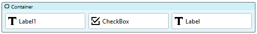
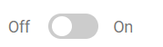

# Switch

A switch is a way to for users to make a boolean selection. Switches imply that they are effective immediately. Use switches when you want users to make a boolean selection that will be applied immediately.

https://github.com/stadium-software/switch/assets/2085324/64812cbc-de58-4e87-8720-9d7bba8c745e

## Version 

1.0 Initial

# Setup

## Application Setup
1. Check the *Enable Style Sheet* checkbox in the application properties

## Page Setup: Switch only
1. Drag a *Checkbox* control to a page 
2. Add the class "stadium-switch" to the control's class property

## Page Setup: Switch with labels
1. Drag a *Container* control to a page 
2. Add the class "stadium-switch" to the control's class property
3. Drag a *Checkbox* control and place it into the *Container*
4. Drag a *Label* control and place it to the left of the *Checkbox* inside the *Container*
5. Enter text in the *Label's* text property to denote the "Off" state of the switch
6. Optionally, drag another *Label* control and place it on the right-hand side of the *Checkbox*
7. Enter text in the *Label's* text property to denote the "On" state of the switch





# Styling
Various elements in this module can be styled using the two CSS files in this repo

## Applying the CSS

**Stadium 6.6 or higher**
1. Create a folder called "CSS" inside of your Embedded Files in your application
2. Drag the two CSS files from this repo [*switch-variables.css*](switch-variables.css) and [*switch.css*](switch.css) into that folder
3. Paste the link tags below into the *head* property of your application
```html
<link rel="stylesheet" href="{EmbeddedFiles}/CSS/switch.css">
<link rel="stylesheet" href="{EmbeddedFiles}/CSS/switch-variables.css">
``` 


**Versions lower than 6.6**
1. Copy the CSS from the two css files into the Stylesheet in your application

## Customising CSS
1. Open the CSS file called [*switch-variables.css*](switch-variables.css) from this repo
2. Adjust the variables in the *:root* element as you see fit
3. Overwrite the file in the CSS folder of your application with the customised file

## CSS Upgrading
To upgrade the CSS in this module, follow the [steps outlined in this repo](https://github.com/stadium-software/samples-upgrading)
